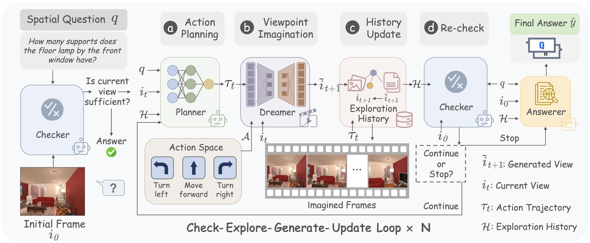

<div align="center">

### AIVE: Active Imagined View Exploration for Visual Spatial Reasoning

**Zhenming Wu · Li Li† · Song Yu · Wenwen Zhao · Zhisheng Yang · Shiyu Zhu**

† Corresponding author

<p>
  <a href="assets/AIVE_EMNLP.pdf"></a>
  <a href="https://www.python.org/"></a>
  <a href="LICENSE"></a>
  <a href=".github/workflows/ci.yml"></a>
</p>

[Overview](#overview) · [Highlights](#highlights) · [Quick Start](#quick-start) · [Dataset](#dataset) · [Usage](#usage) · [Citation](#citation)

</div>

---

## Abstract
While Vision-Language Models (VLMs) have excelled in 2D understanding and shown promise in 3D domains, their spatial reasoning is often hindered by incomplete visual observations. Since active physical exploration to gather missing information is usually impractical, leveraging visual generation to imagine the unobserved views provides a more feasible and efficient solution. We propose AIVE, an efficient active imagined-view exploration framework for spatial Visual Question Answering (VQA) that learns to directly select informative exploration actions, thereby amortizing costly test-time search and scoring. Departing from prior approaches that suffer from substantial inference latency, AIVE employs two key components: a VLM Planner generates targeted exploration strategies, while a generative World Model Dreamer synthesizes 3D-consistent future views accordingly. To facilitate training and evaluation, we introduce SpaThor, a benchmark comprising expert trajectories and action-conditioned visual transitions. Extensive experiments demonstrate that AIVE achieves state-of-the-art performance on challenging spatial reasoning tasks, outperforming prior baselines by an average margin of 5.2%. Notably, it delivers up to a 4.8× inference speedup over imagination-based methods, highlighting its potential for embodied spatial reasoning.

> [!NOTE]
> **SpaThor-1K is being prepared for public release and will be available soon.**

---

## Updates

- **2026-08-26** — Released AIVE v0.1.0 with the inference pipeline, unified
  model adapters, SAT data preparation, evaluation utilities, visualisation,
  offline tests, and CI.
- **2026-08-21** — AIVE was accepted to the **EMNLP 2026 Main Conference**.
- **Coming soon** — Public release of the **SpaThor-1K** benchmark.

---

## Overview



<p align="center"><em>
Figure 1. AIVE checks the current evidence, plans an informative action,
imagines the corresponding viewpoint, updates the exploration history, and
repeats until sufficient evidence is available for the final answer.
</em></p>

AIVE turns passive spatial reasoning into an active process of mental
simulation. Instead of exhaustively searching over action candidates and
scoring every imagined result, it directly generates goal-directed action
trajectories and synthesizes only the views needed to answer the question.

## Highlights

- **Active imagined-view exploration** — gathers missing visual evidence
  without requiring physical interaction with the environment.
- **Goal-directed planning** — predicts informative camera actions directly,
  reducing redundant search and generation.
- **Modular inference pipeline** — cleanly separates the Checker, Planner,
  Dreamer, and Answerer roles.
- **Research-friendly tooling** — includes data preparation, unified model
  adapters, per-category evaluation, visualisation, offline testing, and CI.

### Method at a Glance

| Component | Responsibility | Backbone |
|:---|:---|:---|
| **Checker** `V_check` | Decides whether the current evidence is sufficient | Frozen VLM |
| **Planner** `V_plan` | Predicts a discrete, question-guided action trajectory | SFT VLM with LoRA |
| **Dreamer** `W` | Synthesizes the next imagined view from the current view and action | Wan2.2-TI2V-5B |
| **Answerer** `V_ans` | Aggregates the initial observation and exploration history | Frozen VLM |

---

## Project Structure

```text
AIVE-2026/
├── pipelines/
│   ├── AIVE.py                  # Main active-exploration pipeline
│   └── AIVE_baseline.py         # Dataset, model, logging, and result scaffolding
├── dreamer/
│   ├── base.py                  # Dreamer interface and SE(3) pose conversion
│   ├── mock.py                  # Deterministic backend for offline testing
│   └── wan2_2.py                # Wan2.2-based Dreamer backend
├── utils/
│   ├── args.py                  # Command-line arguments
│   ├── config.py                # Model registry and pipeline defaults
│   ├── data_process.py          # SAT dataset preparation
│   ├── ModelAdapter.py          # Unified VLM interface and agent roles
│   ├── internvl3_adapter.py     # InternVL3 adapter
│   ├── qwen3vl_adapter.py       # Qwen3-VL adapter
│   ├── prompt.py                # Role-specific prompts
│   ├── metrics.py               # Accuracy and answer parsing
│   └── visualization.py         # Analysis and figure generation
├── scripts/run_aive.sh          # Shell entry point
├── tests/                       # Offline unit and integration tests
├── assets/                      # Paper and overview figure
├── .github/workflows/ci.yml     # Lint, type-check, and test workflow
├── pyproject.toml               # Package and tool configuration
└── README.md
```

---

## Quick Start

### 1. Create the Environment

```bash
conda create -n aive python=3.11 -y
conda activate aive
```

### 2. Install Dependencies

Install PyTorch for your CUDA environment first. The following example uses
CUDA 12.4:

```bash
pip install "torch>=2.4.0" "torchvision>=0.19.0" \
  --index-url https://download.pytorch.org/whl/cu124
pip install -r requirements.txt
```

For development:

```bash
pip install -e ".[dev]"
pre-commit install
```

### 3. Configure an API Model

```bash
export OPENAI_API_KEY="your-api-key"

# Optional: use an OpenAI-compatible endpoint
export OPENAI_BASE_URL="https://your-endpoint.example/v1"
```

Google Gemini is also supported through `GOOGLE_API_KEY`. Local InternVL3 and
Qwen3-VL deployments can be configured in `utils/config.py`.

### 4. Prepare SAT

Use an absolute output path so the generated image references remain portable
across pipeline invocations:

```bash
export AIVE_ROOT="$(pwd)"
python utils/data_process.py --output_dir "${AIVE_ROOT}/data" --split val
```

### 5. Run AIVE

```bash
INPUT_DIR=./data/val \
OUTPUT_DIR=./output \
SPLIT=val \
bash scripts/run_aive.sh
```

---

## Dataset

### SAT

The SAT spatial reasoning dataset can be downloaded and normalised directly:

```bash
export AIVE_ROOT="$(pwd)"

python utils/data_process.py \
  --output_dir "${AIVE_ROOT}/data" \
  --split val

python utils/data_process.py \
  --output_dir "${AIVE_ROOT}/data" \
  --split test
```

This produces one self-contained directory per split:

```text
data/
├── val/
│   ├── val.json
│   └── image_*.png
└── test/
    ├── test.json
    └── image_*.png
```

### SpaThor-1K

**SpaThor-1K will be released publicly soon.** The repository already accepts
its `{id, type, question, choices, answer, image}` record layout and normalises
it into the same internal representation used for SAT.

---

## Usage

### Shell Entry Point

The shell driver can be configured through environment variables:

```bash
export OPENAI_API_KEY="your-api-key"

INPUT_DIR=./data/val \
OUTPUT_DIR=./output \
SPLIT=val \
MAX_STEPS=3 \
NUM_QUESTIONS=-1 \
bash scripts/run_aive.sh
```

### Python Entry Point

```bash
python pipelines/AIVE.py \
  --vlm_qa_model_name gpt-4o \
  --split val \
  --input_dir ./data/val \
  --output_dir ./output \
  --max_steps_per_question 3 \
  --dreamer_type mock \
  --num_questions -1
```

Run `python pipelines/AIVE.py --help` to view every option.

### Key Arguments

| Argument | Default | Description |
|:---|:---:|:---|
| `--vlm_qa_model_name` | `gpt-4o` | Model used by the Answerer |
| `--vlm_ap_model_name` | Answerer model | Optional dedicated Planner model |
| `--vlm_d_model_name` | Answerer model | Optional dedicated Checker model |
| `--split` | `val` | Dataset split: `train`, `val`, or `test` |
| `--max_steps_per_question` | `3` | Maximum number of exploration cycles |
| `--dreamer_type` | `mock` | Dreamer backend: `mock` or `wan2_2` |
| `--mock_dreamer_mode` | `identity` | Offline behaviour: `identity` or `shift` |
| `--force_explore` | `False` | Always enter the exploration loop |
| `--num_questions` | `-1` | Evaluation limit; `-1` evaluates all questions |
| `--seed` | `42` | Random seed |

### Supported VLM Adapters

Each pipeline role can use an independent VLM through the unified adapter in
`utils/ModelAdapter.py`.

| Model family | Deployment | Typical role | Configuration |
|:---|:---:|:---|:---|
| GPT-4o / GPT-5 | API | Checker, Planner, Answerer | `OPENAI_API_KEY` |
| Gemini | API | Checker, Planner, Answerer | `GOOGLE_API_KEY` |
| InternVL3 | Local | Planner or full pipeline | `LOCAL_MODEL_CONFIGS` |
| Qwen3-VL | Local | Planner or full pipeline | `LOCAL_MODEL_CONFIGS` |

---

## Outputs

Each run writes aggregate metrics and per-question traces:

```text
output/
├── results.json                     # Overall and per-category accuracy
├── final_log.json                   # Runtime summary
├── run_log_*.jsonl                  # Timestamped VLM-call traces
└── <question-id>/
    ├── step_0/img_0.png             # Initial observation
    ├── step_1/imagined_step_0.png   # Imagined viewpoint
    ├── exploration_checks/          # Checker decisions
    ├── planning_logs/               # Planner interactions
    └── gpt.json                     # Final answer interaction
```

`utils/visualization.py` can generate per-category accuracy charts,
exploration-step histograms, action distributions, and trajectory figures from
a completed run.

---

## Development

```bash
make format   # Apply Ruff formatting and safe fixes
make lint     # Run Ruff lint and formatting checks
make type     # Run mypy on the source packages
make test     # Run the offline pytest suite
```

The tests require no API keys or network access. GitHub Actions runs linting,
format checking, type checking, and the test suite for every push to `main` and
for every pull request.

Contributions are welcome. Please read [CONTRIBUTING.md](CONTRIBUTING.md) before
opening an issue or pull request.

---


## License

The code is released under the [Apache License 2.0](LICENSE). Licensing details
for SpaThor-1K will be published together with the upcoming dataset release.

<div align="center">

**AIVE — explore what is missing, imagine what is needed.**

</div>
